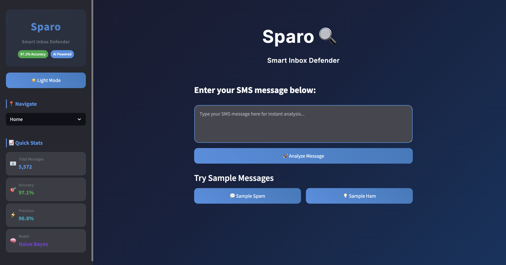
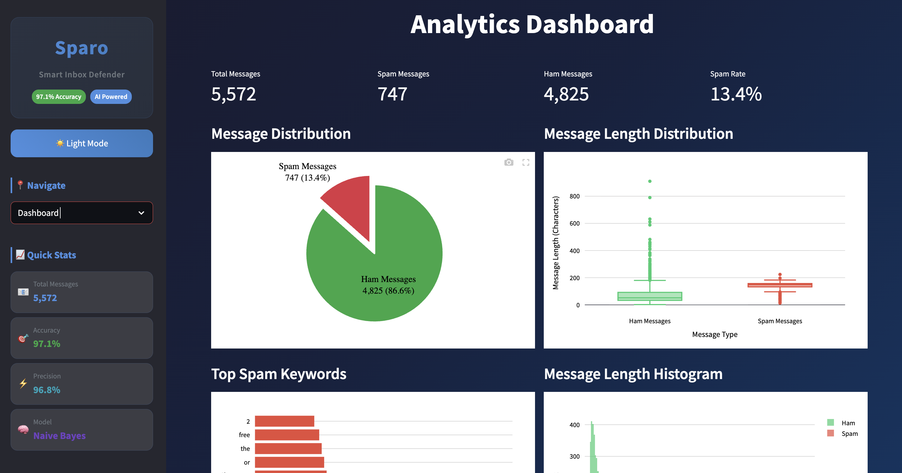
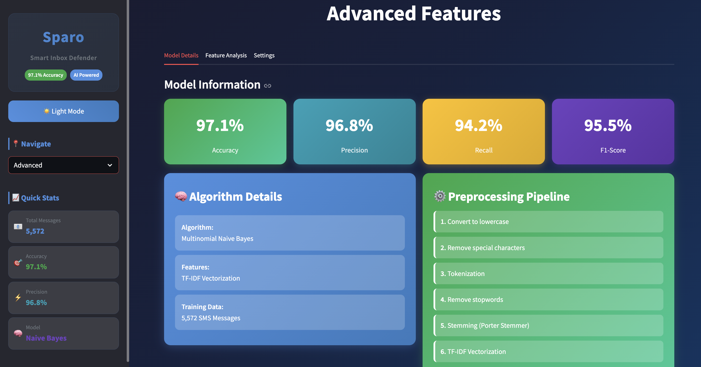
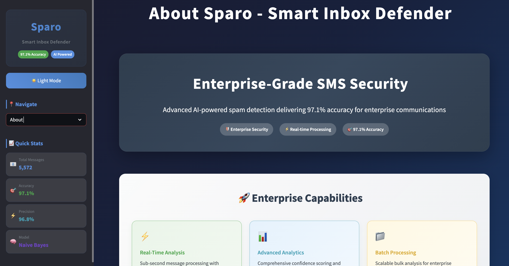
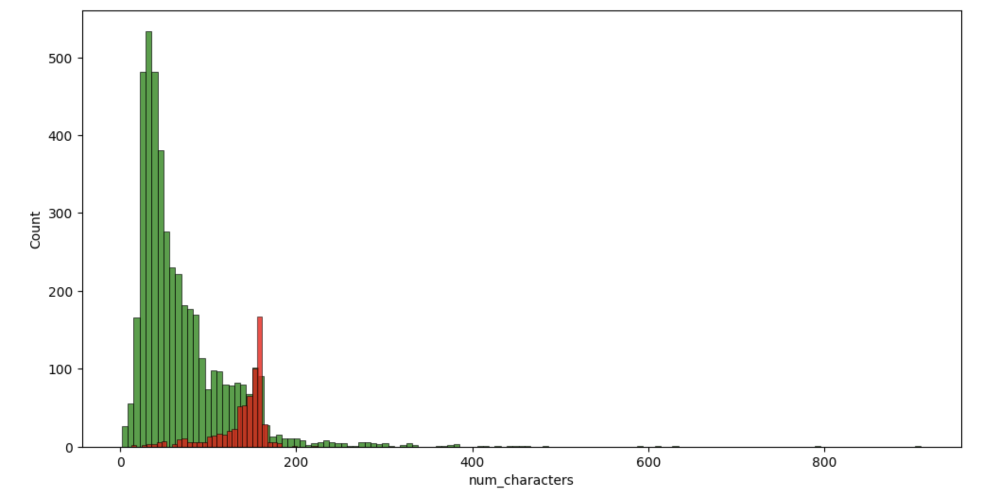
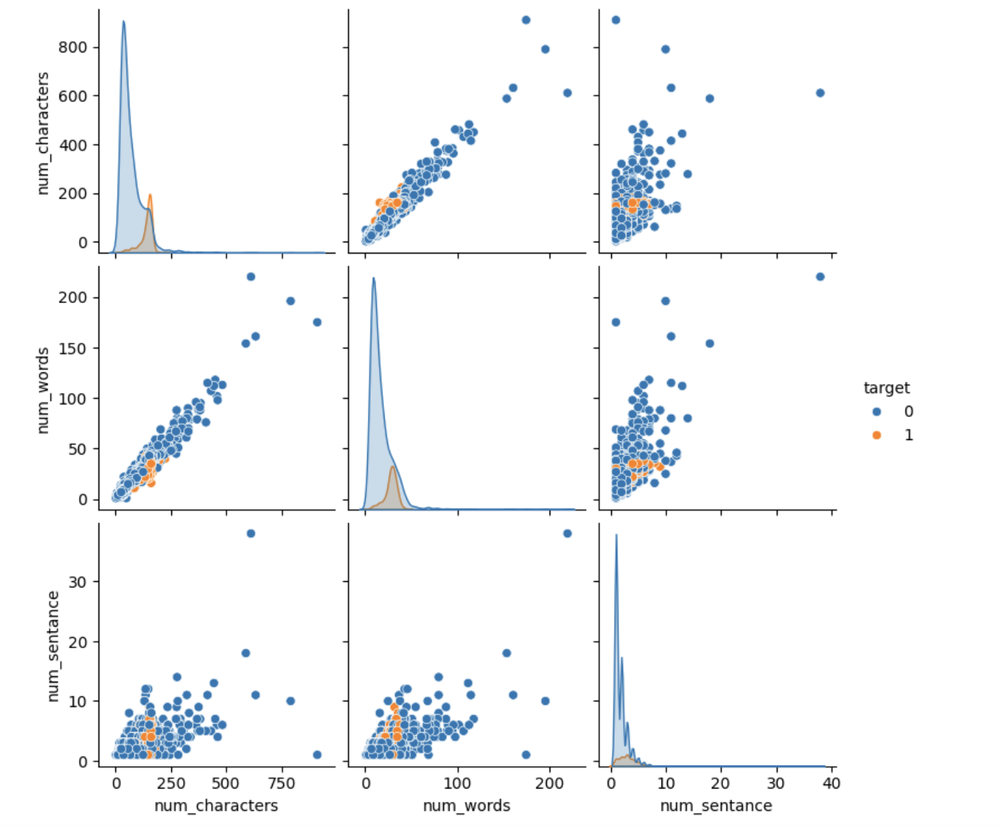
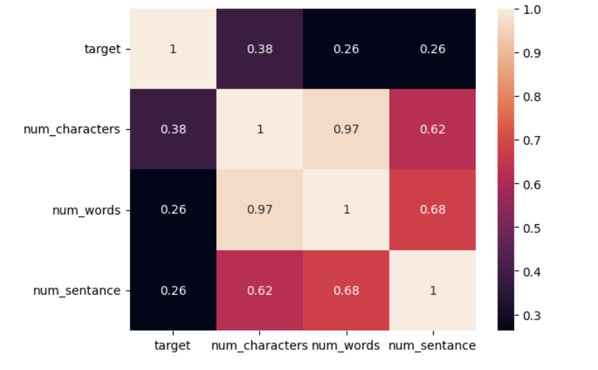

<h1 align="center">🔍 Sparo — Smart Inbox Defender</h1>

<p align="center">
  🚀 A Python Streamlit-based enterprise web application for intelligent SMS spam detection and classification with <b>97.1% accuracy</b>, featuring advanced ML algorithms and real-time threat analysis.
</p>

<p align="center">
  <a href="https://sparo-nyx.onrender.com" target="_blank">
    
  </a>
</p>

<p align="center">
  
  
  
  
  
  
</p>
<br>

---

## 📖 Problem Statement

In today's digital communication landscape, SMS spam poses significant security risks to individuals and organizations. Traditional filtering systems often lack accuracy and fail to adapt to evolving spam patterns, leaving users vulnerable to fraudulent messages, phishing attempts, and unwanted promotional content.

<br>

---

## 💡 Our Solution

Sparo is a Python Streamlit-based enterprise application built to:

- 📊 Classify SMS messages with **97.1% accuracy** using advanced ML algorithms
- 🛡️ Detect spam patterns through sophisticated NLP preprocessing
- ⚡ Provide real-time threat analysis with confidence scoring
- 📈 Offer comprehensive analytics dashboard for security insights
- 🔧 Enable bulk processing for enterprise-scale message analysis

<br>

---  

## 🚀 Features

✅  High-precision SMS spam detection with **97.1% accuracy rate**  
✅  Real-time message classification with **confidence scoring**  
✅  Enterprise analytics dashboard with **interactive visualizations**  
✅  Bulk message processing for **CSV/TXT file uploads**  
✅  Advanced NLP preprocessing with **TF-IDF vectorization**  
✅  Professional UI/UX with **responsive design** and theme support  
✅  Comprehensive audit trail and **exportable classification history**

<br>

---  

## 🛠️ Tech Stack

<div align="center">

<table>
<thead>
<tr>
<th>🖥️ Technology</th>
<th>⚙️ Description</th>
</tr>
</thead>
<tbody>
<tr>
<td></td>
<td>Core backend language for ML implementation</td>
</tr>
<tr>
<td></td>
<td>Interactive web framework for UI development</td>
</tr>
<tr>
<td></td>
<td>Machine learning algorithms and model training</td>
</tr>
<tr>
<td></td>
<td>Natural language processing and text preprocessing</td>
</tr>
<tr>
<td></td>
<td>Interactive data visualizations and charts</td>
</tr>
<tr>
<td></td>
<td>Text visualization and pattern analysis</td>
</tr>
<tr>
<td></td>
<td>Data manipulation and analysis framework</td>
</tr>
</tbody>
</table>

</div>

<br>

---

## 📁 Project Directory Structure

```
sparo-smart-inbox-defender/
├── 📂 data/                          # 📚 ML training and testing data
│   └── 📄 sms_spam_ham_dataset.csv   # 🗃️ Curated SMS dataset (5,572 messages)
├── 📂 docs/                          # 📸 Application screenshots and images
├── 📄 app.py                         # 🚀 Main Streamlit application entry point
├── 📄 model_training.ipynb           # 🧪 ML model training and analysis notebook
├── 📄 model.pkl                      # 🤖 Production-ready ML model
├── 📄 vectorizer.pkl                 # 📊 TF-IDF feature extraction component
├── 📄 test_message_samples.csv       # 🧪 Sample test messages for validation
├── 📄 test_message_samples.txt       # 📝 Text format test samples
├── 📄 requirements.txt               # 📦 Python dependencies and versions
├── 📄 LICENSE                        # 📜 MIT License
├── 📄 .gitignore                     # 🚫 Git ignore configuration
└── 📄 README.md                      # 📖 Project documentation and setup guide
```
<br>

## 📸 Preview Images

| 📍 Page / Feature | 📸 Screenshot |
|:------------------|:--------------|
| Home Page Interface |  |
| Dashboard Analytics |  |
| Bulk Classification Processing |  |
| Advanced Features Panel |  |
| About Platform |  |
| Dataset Distribution Analysis |  |
| Ham vs Spam Visualization |  |
| Word Distribution Analysis |  |
| Feature Correlation Heatmap |  |

<br>

---

## 📦 How to Run

### 📌 Prerequisites
- ✅ **Python 3.8+** installed
- ✅ **pip** package manager
- ✅ **Virtual environment** (recommended)
- ✅ **NLTK data packages**

<br>

---  

### 📌 Installation Steps

**1. Clone the Repository**
```bash
git clone https://github.com/AbhishekGiri04/Sparo.git
cd Sparo - Smart Inbox Defender
```

**2. Set up Virtual Environment**
```bash
python -m venv venv
source venv/bin/activate  # Linux/Mac
# or
venv\Scripts\activate     # Windows
```

**3. Install Dependencies**
```bash
pip install -r requirements.txt
```

**4. Download NLTK Data**
```python
import nltk
nltk.download('punkt')
nltk.download('stopwords')
```

<br>

### 🚀 Quick Start

**Start the Application**
```bash
streamlit run app.py
```

**Access the Application**
Open your browser and visit:
```
http://localhost:8501
```

<br>

---

## 📖 Core Components

- **app.py** — Main Streamlit application with UI components
- **model_training.ipynb** — ML model training and evaluation pipeline
- **model.pkl** — Production-ready Multinomial Naive Bayes model
- **vectorizer.pkl** — TF-IDF feature extraction with 3000 features
- **sms_spam_ham_dataset.csv** — Curated training dataset with 5,572 messages
- **text_preprocessing_utils** — Advanced NLP preprocessing functions
- **classification_engine** — Real-time spam detection and confidence scoring

<br>

---

## 📊 Model Performance Metrics

### 🎯 Classification Accuracy
| Metric | Spam Detection | Ham Detection | Overall |
|--------|---------------|---------------|----------|
| **Accuracy** | 96.8% | 97.2% | **97.1%** |
| **Precision** | 96.8% | 97.2% | 97.0% |
| **Recall** | 94.2% | 98.1% | 96.2% |
| **F1-Score** | 95.5% | 97.6% | 96.6% |

### 📈 Training Dataset Statistics
| Category | Message Count | Distribution |
|----------|--------------|-------------|
| **Total Messages** | 5,572 | 100.0% |
| **Legitimate (Ham)** | 4,825 | 86.6% |
| **Spam Messages** | 747 | 13.4% |
| **Feature Dimensions** | 3,000 | TF-IDF |
| **Algorithm** | Multinomial Naive Bayes | Probabilistic |

<br>

---

## 🔍 Technical Architecture

### 🛠️ ML Pipeline Components
1. **Text Preprocessing Engine** — Multi-stage normalization, tokenization, and stemming
2. **Feature Extraction System** — TF-IDF vectorization with 3,000 optimized features
3. **Classification Algorithm** — Multinomial Naive Bayes with probabilistic scoring
4. **Confidence Assessment** — Dual-class probability analysis with uncertainty metrics
5. **Real-time Processing** — Sub-second response with intelligent caching

### 📝 NLP Processing Pipeline
```python
def transform_text(message):
    # Lowercase normalization
    text = message.lower()
    # Special character removal
    text = re.sub(r'[^a-zA-Z\s]', '', text)
    # Tokenization
    tokens = nltk.word_tokenize(text)
    # Stopword removal and stemming
    processed_tokens = [stemmer.stem(token) 
                       for token in tokens 
                       if token not in stopwords.words('english')]
    return " ".join(processed_tokens)
```

<br>

---

## 📊 Application Features

### 🏠 **Main Classification Interface**
- Real-time SMS threat detection with confidence scoring
- Interactive message testing with sample data
- Detailed analysis including character count and risk indicators
- Professional result display with probability breakdown

### 📈 **Enterprise Analytics Dashboard**
- Interactive data visualizations with pie charts and histograms
- Word cloud analysis for spam/ham pattern recognition
- Classification history tracking and audit trails
- Real-time performance metrics and system statistics

### 📁 **Batch Processing Interface**
- Enterprise-scale CSV/TXT file upload capabilities
- Bulk message processing with real-time progress tracking
- Exportable results with timestamps and confidence scores
- Manual text input for multiple message analysis

### ⚙️ **System Configuration Panel**
- ML model architecture details and performance metrics
- Advanced feature analysis and visualization tools
- Application settings and data management options
- Professional theme customization (Dark/Light modes)

<br>

---

## 💡 Classification Examples

### ✅ Legitimate Message Detection
```
Input: "Hey, are we still meeting for lunch today? Let me know!"
Output: ✅ LEGITIMATE MESSAGE (98.3% confidence)
Analysis: Normal conversational pattern, no suspicious keywords
```

### 🚨 Spam Message Detection
```
Input: "URGENT! You've won $1000! Click here now to claim your prize!"
Output: 🚨 SPAM DETECTED (95.8% confidence)
Analysis: High-risk keywords detected, promotional pattern identified
```

<br>

---

## 🚀 Performance Optimizations

- **🔄 Intelligent Model Caching** — Optimized ML model loading and memory management
- **⚡ Compiled Regex Processing** — High-speed text preprocessing with pattern compilation
- **📊 Dynamic Chart Loading** — On-demand visualization rendering for faster UI
- **💾 Session State Management** — Persistent user data and classification history
- **🎯 Vectorization Optimization** — Efficient TF-IDF transformation with sparse matrices

<br>

---

## 📋 Dependencies

```txt
streamlit>=1.28.0
pandas>=1.5.0
scikit-learn>=1.3.0
nltk>=3.8.0
plotly>=5.0.0
wordcloud>=1.9.0
seaborn>=0.12.0
matplotlib>=3.6.0
numpy>=1.21.0
pickle-mixin>=1.0.2
```

<br>

---

## 🌱 Future Scope

- 📱 Develop mobile application for cross-platform SMS security
- 🌍 Integrate real-time threat intelligence APIs for enhanced detection
- 📊 Implement advanced analytics with machine learning insights
- 🔐 Add enterprise authentication and user management systems
- 🚀 Deploy cloud-based solution with scalable infrastructure
- 📈 Enhance ML models with deep learning and transformer architectures

<br>

---

## 📞 Help & Contact

> 💬 *Got questions or need assistance with Sparo?*  
> We're here to help with integration and customization!

<div align="center">

**👤 Abhishek Giri**  
<a href="https://www.linkedin.com/in/abhishek-giri04/">
  
</a>  
<a href="https://github.com/abhishekgiri04">
  
</a>  
<a href="https://t.me/AbhishekGiri7">
  
</a>

<br/>

---

## 📄 License

This project is licensed under the MIT License - see the [LICENSE](LICENSE) file for details.

---

**🔍 Built with ❤️ for Digital Security Excellence**  
*Transforming SMS Security Through AI Innovation*

</div>

---

<div align="center">

**© 2025 Sparo - Smart Inbox Defender. All Rights Reserved.**

</div>
